## 1.0 Critic of Visualization
### 1.1 Original Visualization
The original visualization is as below

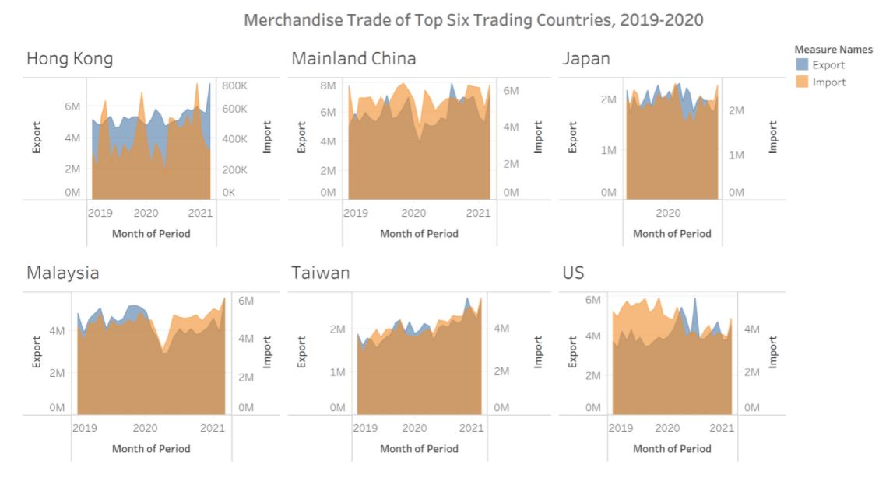

### 1.2 Critic Clarity
* The title partially conveys the intent of the graph. In this case, the graph is showing 2021 in most of the chart’s x-axis however, the title says 2019 to 2020 and also the title mentions top 6 but we are not sure of the ranking of these 6 countries based on the graph provided.
* Since the data is monthly, the title should also have mentioned the month of 2019 to month of 2020 included in the analysis (ie Jan 2019-Dec2020).
* The uneven y-axis scale for exports makes it difficult to compare one country with other countries just by looking as their scales are different. Same applies for imports.
* For country “Japan”, the x axis only has 2020 which is inconsistent from the other countries plotting.
* Existing title only mentions Merchandise trade but does not specify trade with which country.

### 1.3 Critic Aesthetic
* Tick marks are absent on the x axis even though the data is continuous and this makes it difficult to identify which year/month is the corresponding reading from.
* The representation of graph is very poor. The overlap of the exports and imports resulted in another colour and this is making it difficult to interpret if one is looking at the “import” segment or the “export” segment.
* Size of each chart on the graph is different that resulted in uneven x-axis scale among different countries.
* The title is centralized however the country name for each chart respectively did not follow this indentation instead they are towards the left of each chart.
* Absence of major and minor tick marks on both y-axis’s even though the data is continuous.

## 2.0 Alternative Approach
### 2.1 Sketch

### 2.2 Clarity
* The title and subtitle explain the keywords and definitions that will be used in the graph. The sum of imports and exports for each of the six countries is additionally calculated so as to sort the countries in the descending order of total trade.
* Scale on y-axis for exports among all countries is transformed to be same so as to make the comparison easier between countries. Same applies for imports as well.
* Only one x-axis is used across all countries maintaining consistency and also reducing redundancy of scale in the overall graph.
* Upon looking into the data it is understandable that the data is based on trading with Singapore. This is mentioned in the title to make it more clear.

### 2.3 Aesthetic
* Major tick marks are added to the x-axis and the number of major ticks has been increased to 1 tick for every 2 months so as to prevent intensity on the axis.
* Since the axis for exports and imports is different, graphs are represented differently too. Bar plot is used for exports and line graph is used for imports. Colours are used to bring attention to different categories.
* Area of graph for each country is maintained the same to prevent mismatching of scales on axis and misconceptions.
* The title is aligned with the ordered list of country names. (i.e. both are aligned towards the left)
* Major and minor tick marks are used on the y-axis for numerical continuous data.

## 3.0 Proposed Visualization
The alternative proposed visualization can be viewed [**here on Tableau Public**](https://public.tableau.com/app/profile/nikitha4057/viz/DataViz1_16223639230640/TradeTrend).

## 4.0 Static Tableau step-by-step description

**Step 1:** Select only the data table imports and paste into a new sheet using Microsoft Excel and save the file as “imports_clean”. Repeat the same for exports and save it into a new excel file called “exports_clean”

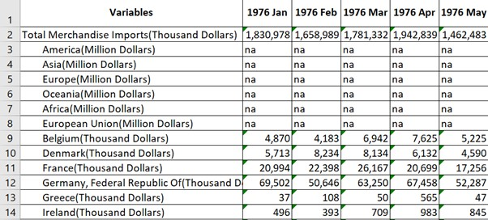

**Step 2:** Import “imports_clean” into Tableau and rename “Variables” to “Country”

**Step 3:** Use Tableau to select only the dates from Jan 2019 to Dec 2020

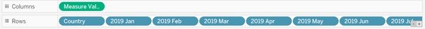

**Step 4:** Remove CNT in measured values

**Step 5:** Apply filter on Country by right clicking on the axis and selecting filter and select only the 6 countries

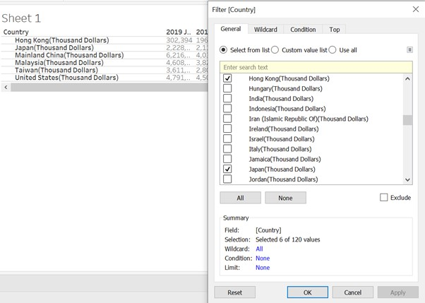

**Step 6:** View data in Tableau, export the data and save the file as “imports2019-20” 

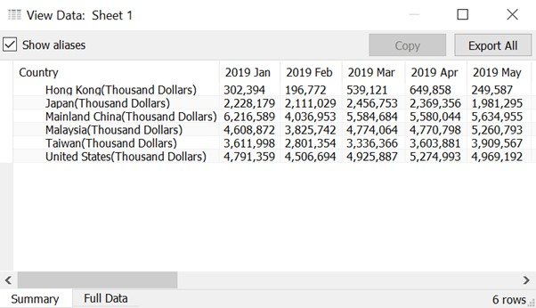

**Step 7:** Repeat step 2 to 6 for “exports_clean” and save it as “exports2019-20”

**Step 8:** Import the exported files into Tableau and pivot all the date columns and rename the pivoted columns into their suitable names. Then join the two files based on the shown relationship

   

**Step 9:** Put measured values in columns and country into rows and remove CNT from measured values

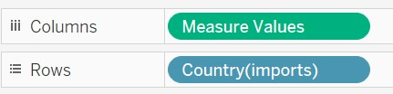
 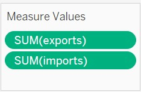

**Step 10:** Export the view data analysis and save it as "total.csv"

**Step 11:** Rearrange imports and exports such that they are side by side and apply below formula in excel to calculate the sum of imports and exports for each country. This step helps in finding the rank of each country

**Step 12:** Import the exported files into Tableau and pivot all the date columns and rename the pivoted columns into their suitable names and change the data type of year/month to date

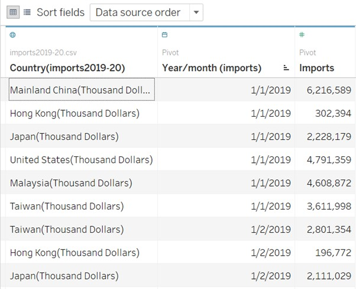

**Step 13:** Merge exported csv files with the following relationships between 'imports and exports' and 'total and exports' as shown in the figure below

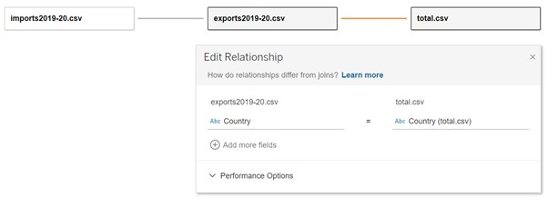

**Step 14:** Add year/month to columns and “country”, “exports” and “imports” to row

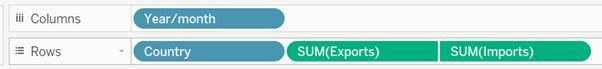

**Step 15:** By default the graphs are represented as scatter plot. Change the plot to bar and line for exports and imports respectively

**Step 16:** Formatting y-axis **->**

* Right click on exports axis and select format and change the color of the axis to match with the bar plot. Repeat the same for imports to match with line graph color

  
  
* The name of countries consists of (Thousand Dollars). Right click on the name and select edit alias to change the name

  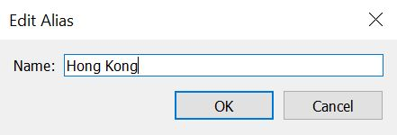
  
* Right click on exports and edit the axis as shown in the images to introduce ticks to the axis as it is continuous

   
  
* For the tick marks to be visible, format the axis and change color to black as shown in the figure. Repeat the same for imports axis

  
  
* After performing the above steps, the graph now looks like:

  

**Step 17:** Formatting x-axis **->**
  
* Change the data type of Year/month to continious

  
  
* Right click on the axis again and select edit axis to introduce tick marks on the axis as it is continuous data and also remove the title Year/month as it is no longer required

   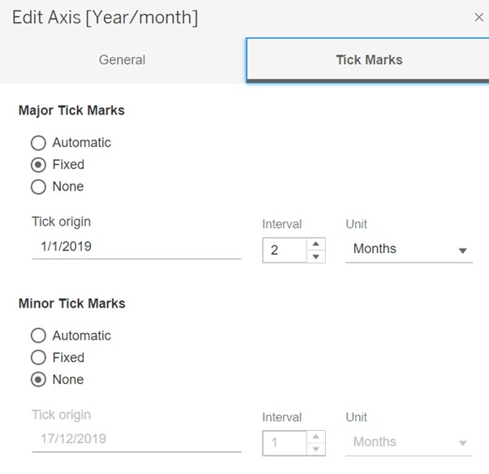

* To make the tick marks visible, right click on the axis select format and change color to black and also change the format of date into "mmm yy" to make it more readable

  

* After performing the above steps, the graph now looks like: 

  

**Step 18:** Now to rank the countries in descending order of their trade values, right click on country and select sort and sort the variable based on field name "Total" as shown below. Double click on  the title to give the graph a valid name and rename the legend title to "Legend" instead of "Measure Names"

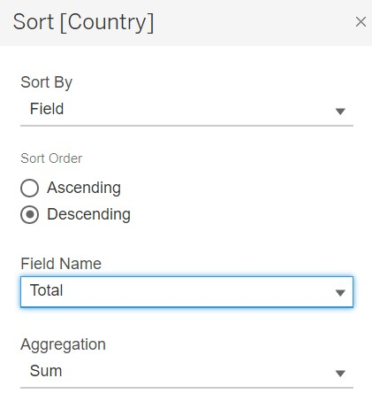
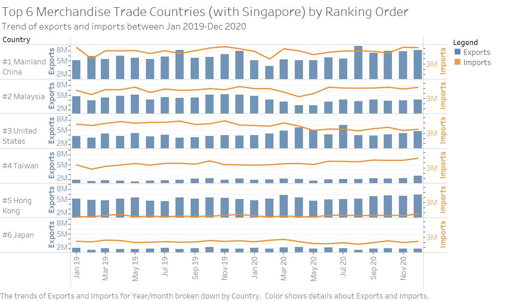

**Step 19:** Lastly, for better understanding of the information, edit the tool kit and the currency representation by editing exports and imports as below

 

**The final graph now looks like:**

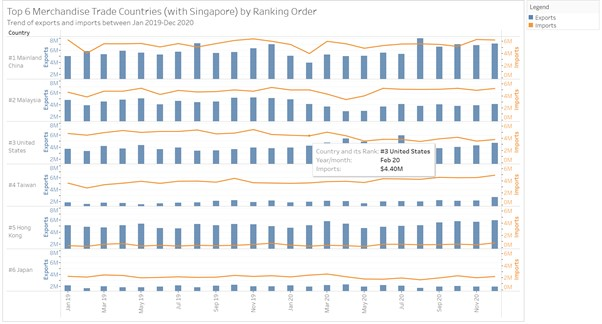

## 5.0  Derived Insights
### 5.1 High Level Observations
Hong Kong is the only county with which Singapore has greater exports than imports. However, it is Japan that has lower total trading value than Hong Kong with Singapore.
In contrast, the country that has the highest trading is China both in terms of total exports and total imports respectively.

### 5.2 Comparing with Covid19 Trend
Feb 2020 was the month with least exports and imports between China and Singapore. Also, it is notable that there is a steep drop in both exports and imports between China from Dec 2019 to Feb 2020. This could be explained by the first confirmed covid19 case in China.

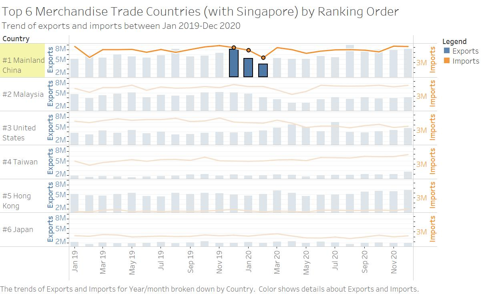

[ThinkChina, 2021](https://www.thinkchina.sg/singapores-prominent-role-chinas-trade-strategy)

### 5.3 Observation during Circuit Breaker period
Another trend that is visible is when Singapore announced circuit breaker measures. It is visible from the graph below that there was significant drop in imports and exports during the months of March 2020 to May 2020 which was when circuit breaker was introduced.

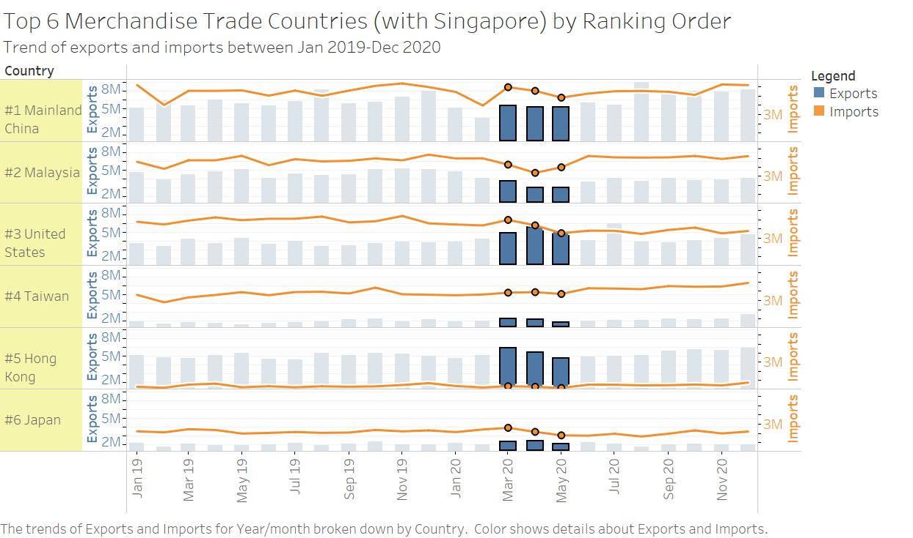

[Ministry of Trade and Industry, 2020](https://www.mti.gov.sg/Resources/feature-articles/2020/Impact-of-the-Circuit-Breaker-and-Budget-Measures-in-Response-to-COVID-19)