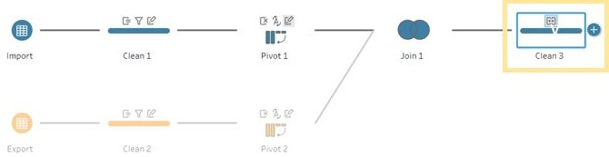

## 1.0 Introduction
This makeover is also based on merchandise trade volume of Singapore provided by Department of Statistics (DOS). The data can be found [here](https://www.singstat.gov.sg/find-data/search-by-theme/trade-and-investment/merchandise-trade/latest-data) under the sub-section "Merchandise Trade by Region/Market".

As part of this visualization, all countries are considered and trades based in January 2011 to December 2020 are used.

**Note: To create the visualization in this Dataviz, Tableau and Tableau Prep Builder are required**

## 2.0 Critic of Original Visualization

### 2.1 Original Visualization
The original visualization is as below

For a more clear and complete visualization, [click here](https://www.singstat.gov.sg/modules/infographics/singapore-international-trade)

### 2.2 Critic Clarity
**Title:** The title of the data visualization does not convey the message well.

* The title mentions ‘Major Trading Partner’ which does not specify if the top 10 countries were taken or if they were randomly selected. 

* The year mentioned in the title is 2020, however, the notes at the bottom mention years dating back to 2006 and 2009. Also, it does not show what were the months considered for analysis.

* The title specifies merchandise trade performance but it is only understandable from looking at the graph that plotting is with respect to exports and imports.

**Chart Type:**

* Since the bubbles are not transparent, at the places where there is an overlap,  it is difficult to view what are the other bubbles below. If a smaller bubble were to be completely under a much bigger bubble, then we would not be able to view the smaller bubble at all. This is a very big limitation.

**Axis:**

* Placing the axis labels at the origin is a bit confusing. Instead the labels could have been at the centre of each axis making it clearer.

* The unit of the axis is also not provided.

**Tooltip:**

* The tooltips  are static and when we hover over a bubble, there is no additional information other than the bubble bouncing. 

* There is some overspill in the graph due to these static tooltips.

* The only information provided per bubble is the total trade and it is difficult to interpret what might be the import and export values for each bubble respectively.

**Animation:**
 
* It shows that Hong Kong and Taiwan are top net exporter and importers respectively. However, the chart does not show it like that. China seems to be the top in both aspects.

### 2.3 Critic Aesthetic

**Chart Type:**

* Multiple colour usage for bubbles is not required since all the countries are plotted against the same axis.

* Also, since the bubbles are not transparent, we cannot see if some of the white dots are falling on the exports or imports side.

**Axis:**

* Using two colour pallets for the background of the graph is not required and also it as no use in this case. 

* Absence of major and minor tick marks on both the axis even though the data is continuous.

**Animations:** There is unnecessary animation usage in this graph. Animations should have meaning then only it will be useful else not.

* All animations used to represent imports and exports for the label of the axis is not required. Using unnecessary animations does not make the graph look good but rather diverts the attention of the user.

* The bouncing of the bubble when the mouse is hovered over it is not required as it provides no additional information.

## 3.0 Alternative Approach
### 3.1 Sketch

### 3.2 Clarity

**Title:** The title and subtitle explain the keywords and definitions that will be used in the graph.

* The title now states the number of countries plotted in the graph and also the year and months that are included for the analysis.

* Additionally, the title changes as the user performs any filter.  The subtitle further mentions the counties that are plotted.

* Instead of using ‘Performance’, ‘Export’ and ‘Import’ terms are used to describe the graph accurately.

**Chart Type:**

* The bubbles are given transparency so as to view any overlapping bubbles.

* Instead of using colour for the chart in the background to differentiate exports and imports, reference lines were used to form 4 quadrants and annotations were put in place and labelled accordingly.

**Axis:**

* The label of axis is placed in the centre to make it clearer and also unit sign ($) is introduced.

* The axis does not begin with zero and this helps to enlarge the view of bubbles and also prevents major overlapping as most of the countries happen fall in the quadrant with low import and export. Therefore, avoiding starting with zero will prevent all closely plotted bubble from overlapping.

**Tooltip:**

* The tooltips added give additional information then what is shown in the plot. Whenever a user hovers over a bubble, he can view the value of exports, imports, total trade and the rank of exports and imports for that country. Additionally, the trend of merchandise trade over the years can also be viewed as a bar plot.

* Since the tooltips are not static, there is no overspill of the graph.

### 3.3 Aesthetic

**Chart Type:**

* Only one colour scheme is used for the bubbles. Darker meaning that  the value of trade is more and lighter meaning the trade value is small. The same implies for size as well.

**Axis:**

* Major and minor tick marks on both the axis are introduced. The interval for minor marks is set such that there is no overcrowding in the axis.

**Animation:**

* Animation is used to provide seamless movement of bubbles when a user filters based on year or country. This seamless motion helps the user to watch the bubble as they move without breaks.

## 4.0 Proposed Visualization
The alternate proposed visualization is as follows:

It can be viewed [**here on Tableau Public**](https://public.tableau.com/app/profile/nikitha4057/viz/DataViz2_16241913007550/MotionBubblePlot).

## 5.0 Building Alternative Design
Follow below steps to prepare the above visualization:

### 5.1 The Data
Download the data from Statistics Singapore website and extract the file. It will be in '.xlsx' format. There will be two sheets present within the excel file. Sheet 'T1' is data on imports and 'T2' is data on exports. Below is a snapshot of how the raw data looks like.

### 5.2 Data Preparation Steps

As part of data preprocessing, Tableau Prep Builder was used. This platform was choosen because it is easy and quick to work on.

**Step 1:** Open the Prep Builder and drag and drop the file into it. The builder will then open up a flow workspace where we can work on processing the data.

**Step 2:** Drag and drop 'T1' and 'T2' in the work space as shown.

**Step 3:** Rename 'T1' and 'T2' to 'import' and 'export' respectively. Also, select the 'Use Data Interpreter' and click on view and clean data for 'import' and 'export'.

**Step 4:** Next, click on 'Clean 1'. To retain only the country names from 'Variables' column, right click on "Variables" and select split -> Custom Split and split the records at '('. Then click on "Split" button.

**Step 5:** Then rename the new generated column to 'Country'. Repeat step 4 and 5 for 'Clean 2'.

**Step 6:** Right click on 'Country' under 'Clean 1' and select 'Selected Values' filter and exclude all non Countries and Total trade observation records as shown. Repeat the same for 'Clean 2'

**Step 7:** Add pivot nodes to Clean 1 and 2. Select all the months fields and drop them into "Pivoted Fields". Delete "Variables" field. Repeat same for Pivot 2.

**Step 8:** Under Pivot 1, rename ‘Pivot1 Names’ to ‘Month’ and change data type to ‘Date’. Rename ‘Pivot1 Values’ to ‘Import (Thousand Dollars)’. Repeat for ‘Pivot 2’ but rename ‘Pivot2 Values’ to ‘Export (Thousand Dollars)’.

**Step 9:** Add a join after 'Pivot 1' and drag the 'Pivot 2' and drop it under "Add" as shown below.

**Step 10:** Change the join type to full and match with ‘Country’ and ‘Month’ as the join clauses.

**Step 11:** Add a ‘Clean’ node after ‘Join 1’ to merge all the duplicate columns and remove unnecessary dates.

**Step 12:** Create a ‘Output’ node after ‘Clean 3’  and save output as "Singapore Monthly Merchandise Trade_Exports&Imports" and run the flow. This will save the ".hyper. file in the specified location.

**Step 13:** Add a ‘Pivot’ node after ‘Clean 3’ and drag and drop ‘Export (Thousand Dollars)’ and ‘Import (Thousand Dollars)’ into "Pivoted Fields". Split ‘Pivot1 Names’ and rename the generated field to ‘Trade Type’. Next, multiply variable ‘(Thousand Dollars)’ by 1000 and rename it ‘Trade Value’. Remove the unnecessary fields ‘(Thousand Dollars)’ and ‘Pivot1 Names’. Also, filter the dates just like in Step 11.

**Step 14:** Create another ‘Output’ node after ‘Pivot 3’ node and save output as ‘Singapore Monthly Merchandise Trade’and run the flow. This will save the ".hyper. file in the specified location.

**After performing the above steps, we should be having two ".hyper files with us. One with exports and imports separated and another combined.**

### 5.3 Charts Creation Steps

All following steps ae performed in Tableau.

**Plotting the graph:**

**Step 1:** Open Tableau and drag and drop both the '.hyper' files to create a connection. Under 'Singapore Monthly Merchandise Trade_Exports&Imports', create a calculated field for 'Export (Thousand Dollars)' and multiply it by 1000. Rename the newly created field to 'Export. Repeat the same for 'Import (Thousand Dollars)' and rename the field to 'Import'. After this, hide the 'Thousand Dollars' fields from all further analysis. Match country with country and month with month to combin the two files as show below.

**Step 2:** For chart 1, open a new worksheet and name it as 'Bubble Plot'. Drag and drop 'Export' and 'Import' into roes and columns respectively. By default, Tableau aggregates all data as total of 'Export' and 'Import'. Therefore, in order to make it understand to plot the scatter plot by countries, we need to drop 'Country' field into detail.

**Step 3:** Next, drag and drop 'Trade Value' into color and size so that the darkness of the color and size of each bubble plot will be according to how big or small the trade value is. Change the graph to circle and edit the color and introduce border and transparency  to the bubbles. This is so as to view any overlapping bubbles that me be there in the plot.

**Step 4:** For nulls that exist, click on the nulls and select 'Filter Data'. This will not include nulls for all further analysis.

**Filter: Since the data is very vast including trades from 2011 to 2020, providing interactivity to the user by allowing him to select the year he wants to analyze and the countries he wants to view will help narrow down and understand the analysis even more. This is where filters come in picture. They provide intractability  to the user. In out case, the user can be provided options to select year and the countries he wants to analyze on.**

**Step 5:** To add filter on year, drag and drop 'Month' into filter and select year and by default set the year selection to 2020. This will enable default view of the plot to be based on 2020 data only.

**Step 6:** To provide a filter by country, drag and drop country into filter and select all countries under 'General' tab. This will allow all countries to be analyzed. Next, go to 'top' and add a parameter and name it 'Top Countries'. Set the default value to be 10 and update the maximun value to the number of countries there are. Then click on 'Ok'. Change the field to 'Trade Value'. This will enable the filter to display only the top 10 highest trade value countries. Switch back to th general tab and select 'Use All'.

**Step 7:** Right click on countries filter and select 'Show Filter'. This will display the filter to wards the right of the dashboard. Repeat the same for 'Month' filter and the new parameter created that is located at the bottom left of the page.

**Step 8:** Hide unnecessary cards and change the selection criteria of country and month to 'Multiple Valus(dropdown)' and 'Single Value(dropdown)'. Also, change the parameter selection to 'Type In'. Performing these steps will enable the user to better understand the type of filers that are there.

**Axis: Formatting the axis is an important as it is from the axis that we understand the type of data we are dealing with.**

**Step 9:** Right click on the x axis and select edit axis. Under general tab,edit the title of the axis to include the units. Under tick marks tab, use fixed number of ticks rather than automatic so as to not over populate the axis and set the interval. After this, right click on the axis again and this time select format. Under axis tab, change the color of the ticks to black so that the tick marks will be visible. Repeat the same steps for y axis.

**Step 10:** For the second chart, create a new work sheet and name it 'Yearly Trade'. Drag ‘Country’ and ‘Month’ to ‘Columns’ and ‘Trade Value’ to ‘Rows’. Under ‘Marks’, select ‘Bar’ and drag and drop ‘Trade Type’ to ‘Color’. Drag ‘Trade Value’ to ‘Label’ and add ‘Quick Table Calculation’ to add the ‘Percent of Total’ computed using ‘Cell’. Then drag ‘Trade Value’ to label again.

**Step 11:** Click on the Y-axis and add a reference line using the value of ‘SUM(Trade Value)’ at ‘Per Cell’ level. Remove the line.

**Step 12:** Format the trade values shown using ‘Currency (Custom)’ with ‘Billions (B)’ as display unit at 1 decimal place. Then, hide the worksheet.

**Tooltip: Rather than showing all details on the plot, it is better to use the toolkit. This will reduce the clutter in the graph and also improves intractability  of the user.**

**Step 13:** Create a new calculated field and name it as 'Ranking by Export'. Use the below formula and click on 'Ok'. This calculated filed will denote the rank of the exports of that country in the toolkit. This enables easy readability to the user. Repeat the same for imports and name the calculated field as 'Ranking by Import'.

**Step 14:** By default, the ranking will be based on computation of the whole table. So specify that the ranking must be based on country. To perform this, click on the arrow beside 'Ranking by Export' and under compute using, select country. Repeat the same for import.

**Step 15:** Format the import axis by changing its text color with respect to the color of exports in chart 2 and also under pane, change the number format to currency as shown below. Repeat this step for export axis.

**Step 16:** Format the toolkit by clicking on toolkit and formatting the text as shown. Additionally, add the 'Yearly Trade' sheet to the toolkit. This will provide the user to look at the trend of trade for that country over the years. The main idea of this step is to improve the user understadability of the analysis.

**Final Touches:**

**Step 17:** Add a reference line to x axis. Set the value to be average of sum of imports and chose the line to be dotted and a dark gray color. This is done so as to elevate the reference line from the axis in the background. After that, format the reference line and change the value as below. Repeat the same for y axis

**Step 18:** Right click on the plot and select annotate area. Use these annotations to display the level of export and import such as high and low on the four quadrants formed by the reference lines.

**Step 19:** Edit the title to a meaningful one. Since our charts are interactive, there value need to change as and when the user filters values. Therefore, we need to insert the parameter values and other filters into the title so that the title changes as the filters change.

**Step 20:** Lastly, since the data visualized is year based and the user can select the year he wants to analyze, whenever the user changes the year, it is better if there is an animation involved. This enables the movement of the bubbles to be seamless without any breaks and helps improve user experience. Under 'Format', select 'Animation' and by default it will be off. Change 'On' and adjust the duration accordingly.

### 6.2 Trading with United States
From 2011 to 2017, US has always fallen in the quadrant that is "High Import" "Low Export".It's exports percentage was always below 42% before 2018 with the highest total trade being $79.9B recorded in 2017. However, since 2018, this trend has changed and the US now falls under "High Imports" "High Exports" quadrant. This is due to the increase in the value of exports with their country. Since 2018, there has been a steady increase in exports with the US and in 2020, the value of exports even over took the value of imports by $5.7B.
Another interesting insight is that US has always been among the top 3 from 2011 to 2020.

### 6.3 Common Trend in 2016
A common trend can be seen among countries for the year 2016. There was a decrease in total trade for majority of the countries. This could be explain by the series of events that took place in 2016. The sharpest fall was recorded in trade with China where the total trade decreased from $128.6B to $117.2B. Majority of this drop is due to exports that reduced to $61.3B from $70.7B

[The Economic Times, 2016](https://economictimes.indiatimes.com/news/international/business/five-events-that-shook-world-economy-in-2016/articleshow/56182833.cms)